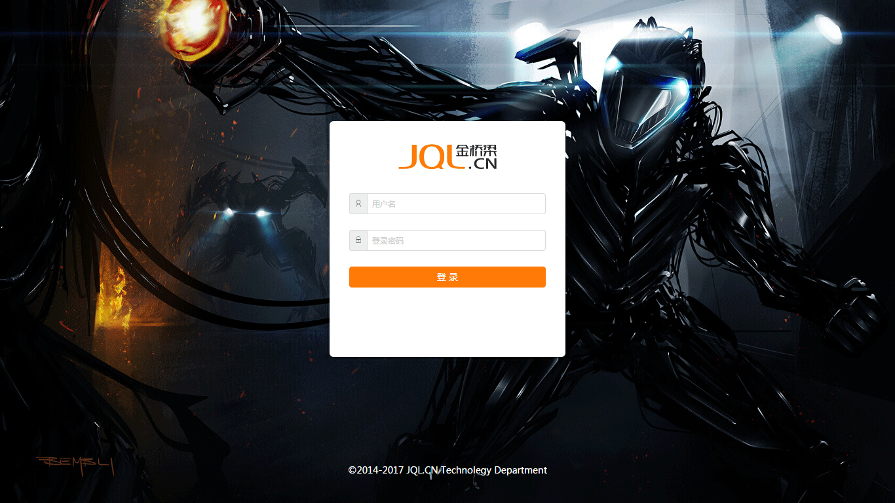

# 一个React构建的周总结系统

这是一个React开发的简易周总结系统，通过create-react-app构建工具生成，包含登录、汇总列表、单期列表、用户总结、总结提交等功能。

构建工具的更多信息请参考：https://github.com/facebookincubator/create-react-app

## 运行

### 安装依赖包

```sh
npm run install
```

### 运行开发环境

```sh
npm run start (http://localhost:3000)
```

### 编译发布包

```sh
npm run build
```

### 查看编译效果

```sh
npm install pushstate-server -g
pushstate-server build (http://localhost:9000)
```

## 界面效果




# A summary system created by React

This is a simple weekly summary system created by React, by the build tool create-react-app，it includes login, totol list, weekly list, user summay, submit summary etc.

For more information of the tool：https://github.com/facebookincubator/create-react-app

## Getting Started

### installation

```sh
npm run install
```

### Run a development enviroment

```sh
npm run start (http://localhost:3000)
```

### Build the publish package

```sh
npm run build
```

### See the result

```sh
npm install pushstate-server -g
pushstate-server build (http://localhost:9000)
```

## User interface


